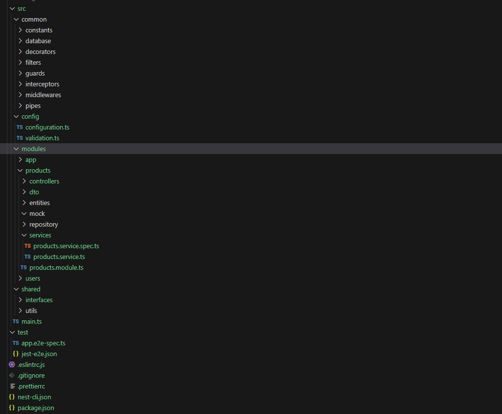

# Neversitup-test

**Module-based Architecture**

## Project Conventions

1. **Naming Conventions**
   - Use PascalCase for class names and file names containing a class (e.g., `ProductsService.ts`)
   - Use camelCase for variable and function names
   - Use kebab-case for folder names and non-class file names (e.g., `products-service.spec.ts`)
   - Use UPPER_SNAKE_CASE for constants

2. **File Structure**
   - Each module should have its own folder under `src/modules/`
   - Common utilities, interfaces, and shared code should be placed in `src/common/` or `src/shared/`
   - Configuration files should be placed in `src/config/`

3. **Module Structure**
   - Each feature module should have the following structure:
     - `controllers/`: API endpoints
     - `dto/`: Data Transfer Objects
     - `entities/`: Database models
     - `services/`: Business logic
     - `repository/`: Database queries (if using repository pattern)
     - `[module-name].module.ts`: Module definition

4. **Testing**
   - Place unit tests next to the file being tested with a `.spec.ts` extension
   - Place e2e tests in the `test/` directory

5. **Code Style**
   - Use ESLint for linting (configuration in `.eslintrc.js`)
   - Use Prettier for code formatting (configuration in `.prettierrc`)

6. **Git Practices**
   - Use meaningful commit messages
   - Create feature branches for new features or bug fixes
   - Use pull requests for code review before merging to main branch

## Getting Started

1. Clone the repository
2. Install dependencies: `npm install`
3. Set up your environment variables (copy `.env.example` to `.env` and fill in the values)
4. Run the development server: `npm run start:dev`

## Available Scripts

- `npm run start`: Start the production server
- `npm run start:dev`: Start the development server with hot-reload
- `npm run test`: Run unit tests
- `npm run test:e2e`: Run end-to-end tests
- `npm run lint`: Lint the code
- `npm run build`: Build the project for production

## Contributing

Please read our contributing guidelines before submitting pull requests.

## License

This project is licensed under the MIT License.